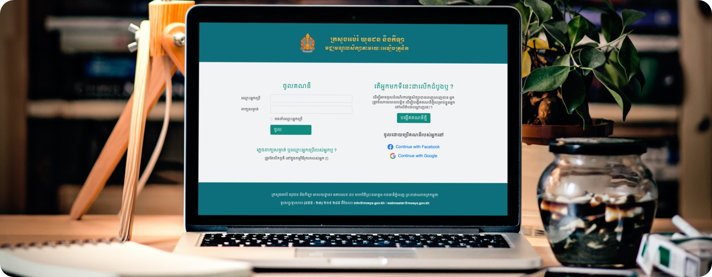

[](#readme)

# MoEYS Gluu Custom Theme
> WIP

## Getting Started
To getting started with installing this custom theme login to the Gluu `chroot` environment:

```sh
sudo /sbin/gluu-serverd login
```

Then clone this repo to your Gluu `chroot` env:
```sh
$ cd ~ # Change directory to the home directory
$ git clone https://github.com/socheatsok78/moeys-gluu-theme.git
```

### System Requirement
Please check you server system requirement below:
The `make` and `stow` command are required to be installed on your system before continue:

```sh
$ sudo apt install make stow
```

### Install theme
To install this theme simply run the following comman:

```sh
$ sudo make
```

This will create a symbolic link with `src` folder and Gluu themplate foler.

> Please note that installed template will create symbolic link from `src` to your Gluu installation.

### Un-Install theme
To un-install this theme simply run the following comman:

```sh
$ sudo make uninstall
```

This will remove the template from your current Gluu installation.


### Post-Install
After successfully install the theme, run the following command:

```sh
$ chown -R jetty:jetty /opt/gluu/jetty/*/custom/pages/
$ chmod -R a-x+rX /opt/gluu/jetty/*/custom/pages/
```

### License
[](LICENSE)
